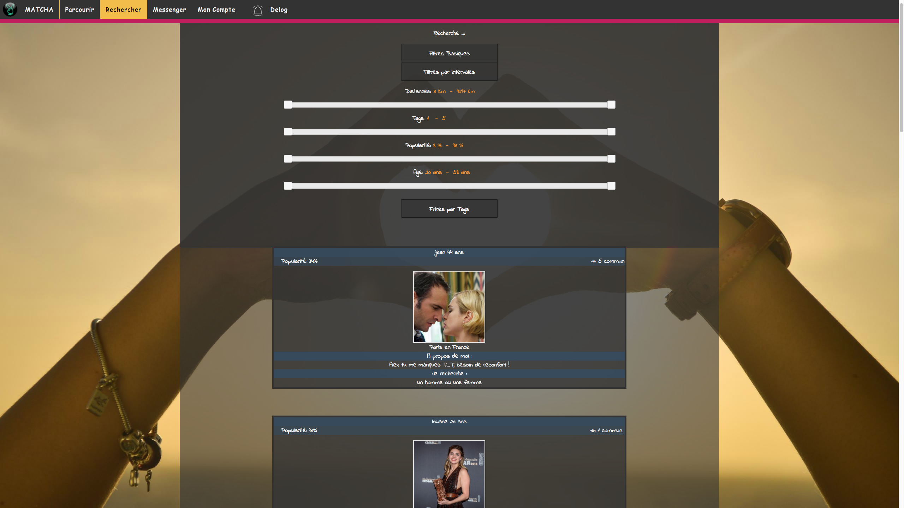
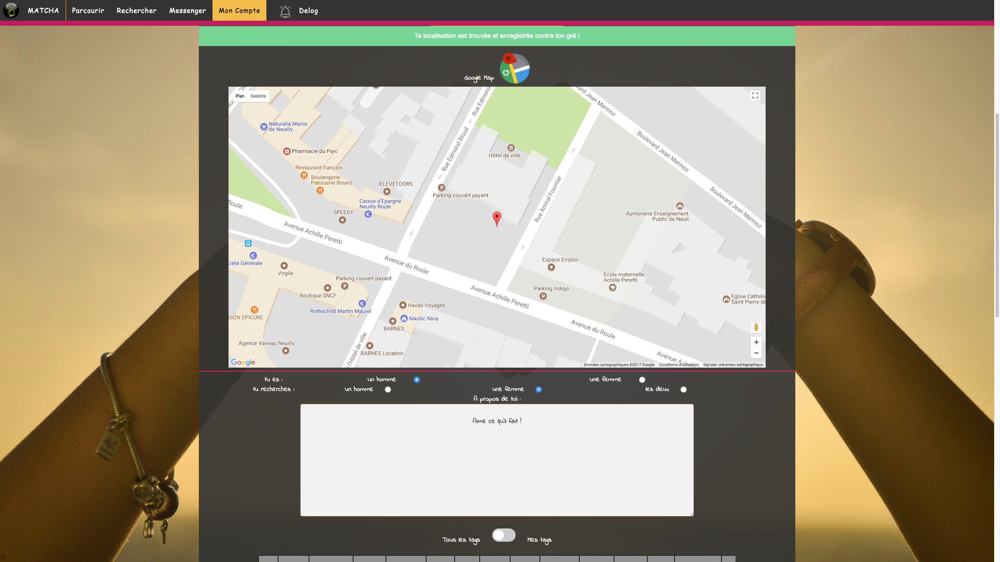
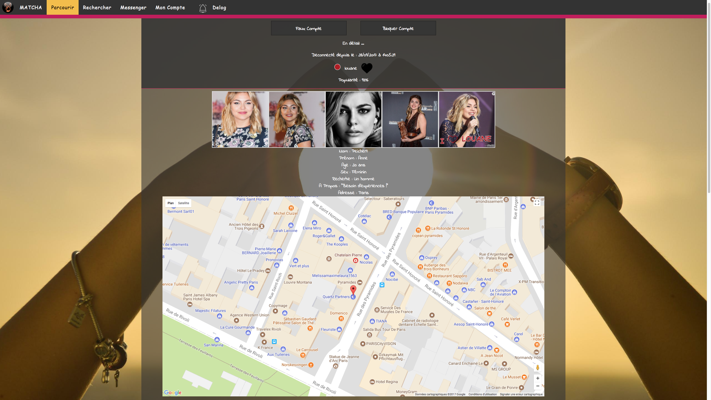
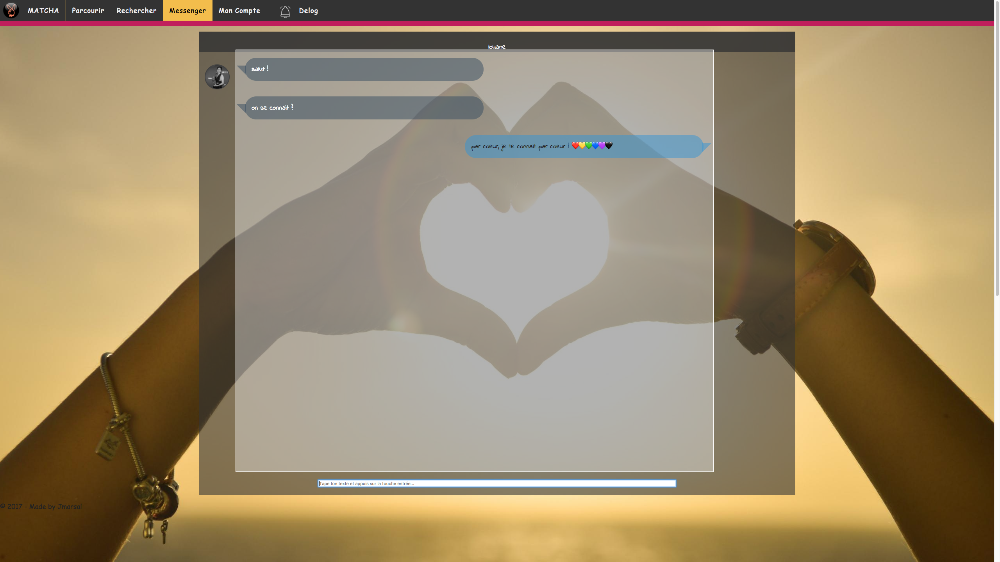

## Contributeurs
[@jmarsal](https://github.com/jmarsal)

## Note Final
`107/100`
# Projet Matcha 42

`Ce projet vous propose de créer un site de rencontres`

`Vous devrez donc concevoir une application permettant à deux
potentielles âmes soeurs de se rencontrer, de l’inscription au
contact final.`

Pour ce projet, vous êtes libres d’utiliser le langage de votre choix.
Vous pouvez utiliser un micro-framework, et toutes les librairies du monde pour ce
projet.

On considerera qu’un “micro-framework” a un routeur, et éventuellement du templating,
mais pas d’ORM, de validateurs ou de gestion de comptes utilisateurs 1
. Tant que
vous respectez ces contraintes, vous êtes libre d’utiliser celui qui vous plaira.

Si vous avez besoin d’inspiration, on suggérera, pour les principaux languages :
1) Sinatra pour Ruby.
2) Express pour Node (oui, nous le considérons comme un micro-framework).
3) Flask pour Python.
4) Scalatra pour Scala.
5) Slim pour PHP (Silex n’est pas autorisé en raison de l’intégration de Doctrine).
6) Nickel pour Rust.
7) Goji pour Golang.
8) Spark pour Java.
9) Crow pour C++.
Vous êtes libre d’utiliser le serveur web de votre choix, que ce soit Apache, Nginx ou
même un built-in web server.
L’ensemble de votre application devra être au minimum compatible sur `Firefox (>=41)` et `Chrome (>= 46)`.
Votre site doit avoir une mise en page décente : c’est à dire au moins un header, une
section principale et un footer.
Votre site devra être présentable sur mobile, et garder une mise en page acceptable
sur de petites résolutions.

Tous vos formulaires doivent avoir des validations correctes, et l’ensemble de votre
site devra être sécurisé. Ce point est obligatoire et sera vérifié longuement en soutenance.

Pour vous faire une petite idée, voici quelques éléments qui ne sont pas considérés comme
sécurisés :

• Avoir des mots de passe “en clair” dans une base de données.

• Pouvoir injecter du code HTML ou JavaScript “utilisateur” dans des variables mal
protégées.

• Pouvoir uploader du contenu indésirable.

• Pouvoir modifier une requête SQL.

## Stack
NodeJS - Express - MySql - SASS - CSS - WebSocket

## Manuel
Requière **NodeJs** >= `7.9` && **NPM** >= `5.0.3` || **Yarn** >= `0.24.6` && **MySql** >= `5.7.19 configure sur le port 3306 avec id: root pass: root`
1. Avec Yarn
    1. `./morning.sh`
    3. `yarn run start`
2. Avec NPM
    1. `npm install`
    2. `npm run start`
3. Sur chrome ou firefox => [localhost:3000](http://localhost:3000/)

